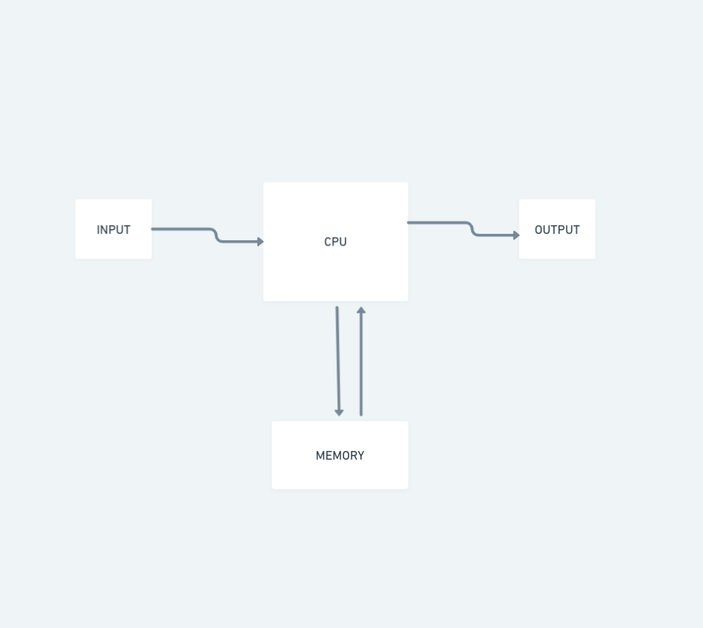
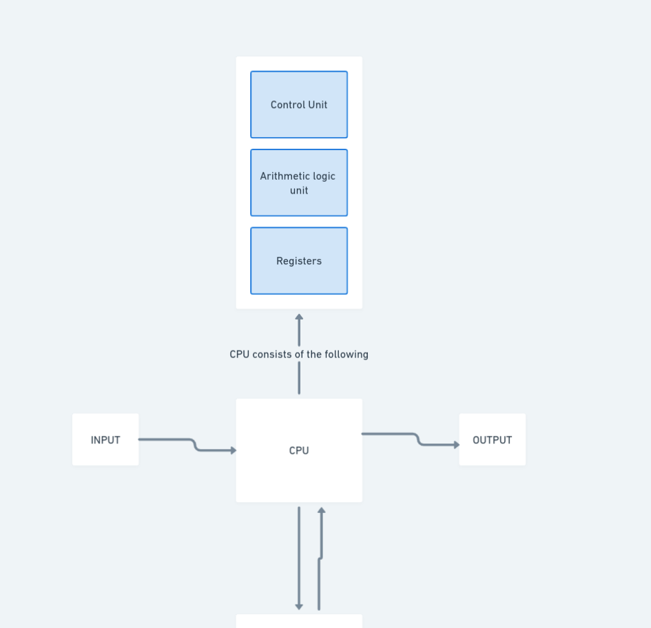
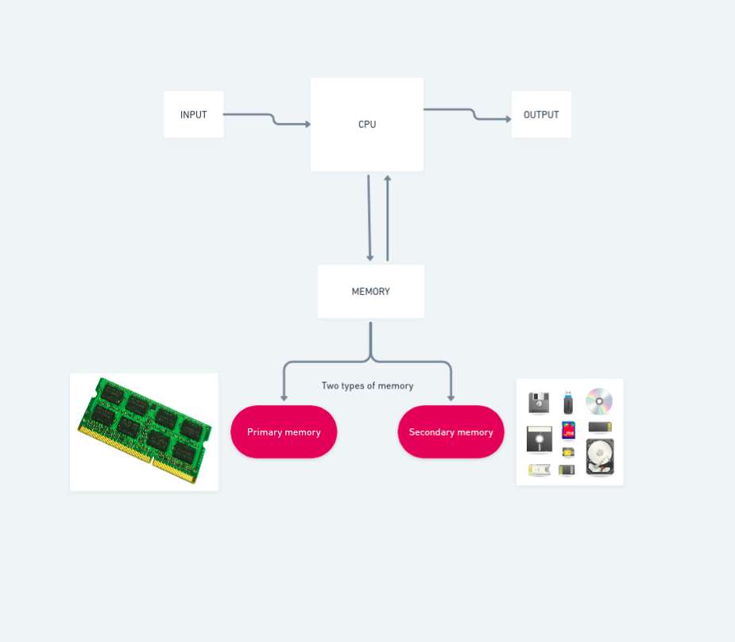
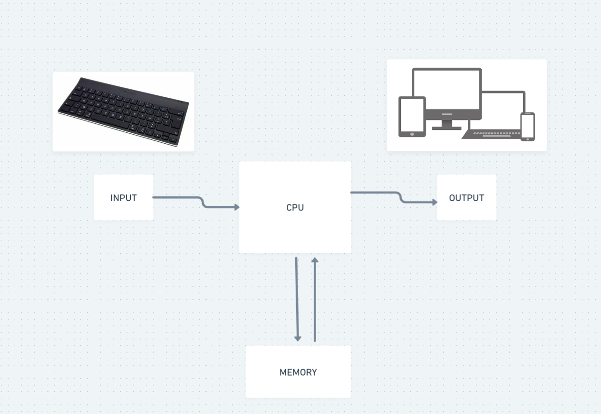

# Part 1

## a. Computer

This part is covered in ICT. But, we need it here to see how the three main parts of a computer system are important to programming. 

> A computer is a digital electronic machine that can be **programmed** to carry out sequences of **arithmetic** or **logical operations** (computation) automatically. Modern computers can perform generic **sets of operations** known as **programs**. These programs enable computers to perform a wide range of **tasks**.
>
> [Wikipedia](https://en.wikipedia.org/wiki/Computer)

### Parts of a computer system

The three main parts of a computer system are:

- Central processing unit (often abbreviated  CPU)
- Memory
- Input and output devices (I/O devices)

Central processing unit (often abbreviated  CPU)

The CPU *processes* and ***executes*** **instructions**.



#### CPU Parts

- Control unit - directs the **operation** of the processor on how to respond to the **instructions**.
- Arithmetic logic unit (often abbreviated ALU) - performs **arithmetic** and **bitwise operations** on integer **binary numbers**.
- Registers - a quickly accessible location available to a computer's processor — they're small storage units

 

#### Memory

The computer stores data in memory. There are two types of memory

- Primary memory - you got that
- Secondary memory - you got that



#### Input and output devices (I/O devices)

I/O devices to interact with the users




## b. Programme

A set of **instructions** that describes how to perform a specific **task** to a computer.

Here's an example programme taken from [Eloquent JavaScript](https://eloquentjavascript.net/00_intro.html#h_oAyXcPDj8N) to explain this and the subsequence sections.

This example programme add the numbers from 1 to 10 together and print out the result: 

`1 + 2 + ... + 10 = 55`

```js
let total = 0;
let count = 1;
while (count <= 10) {
  total += count;
  count += 1;
}
console.log(total);
// → 55
```

If you have not used JavaScript before, this example might be a bit complex. But do not worry, you can safely skip it for now.

This will be discuss in detail later in part 2

If I ask you to solve this, how would you solved it?

## c. Computer Programming

The act of **instructing** computers to perform **tasks**.

This is done by a programmer — a person who writes **code**.

In part 2, we will introduce you to the basic principles of how to instruct a computer.

A programmer write code, if you want to be a programmer write code. You learn to program by programming.

## d. Programming language

An artificial language designed to communicate instructions to a machine.

There are two types of programming languages

- Low-level languages 
- High-level languages 

### Low-level languages

Language understood by the CPU (Machine code and Assembly language). A sequence of bits (the ones and zeros).

In the beginning, at the birth of computing, there were no High-level programming languages. Programmes looked something like this:

```
00110001 00000000 00000000
00110001 00000001 00000001
00110011 00000001 00000010
01010001 00001011 00000010
00100010 00000010 00001000
01000011 00000001 00000000
01000001 00000001 00000001
00010000 00000010 00000000
01100010 00000000 00000000
```

**Machine code**: The instruction to add the numbers from 1 to 10 together and print out the result.

Each line contains a single instruction.

One might ask, how do programmers do programming in early computers?

The programme written in machine code could be written in plain english like this:

```
1. Store the number 0 in memory location 0.

2. Store the number 1 in memory location 1.

3. Store the value of memory location 1 in memory location 2.

4. Subtract the number 11 from the value in memory location 2.

5. If the value in memory location 2 is the number 0, continue with instruction 9.

6. Add the value of memory location 1 to memory location 0.

7. Add the number 1 to the value of memory location 1.

8. Continue with instruction 3.

9. Output the value of memory location 0.
```

Programme in plain english

This is more readable than the bits (the ones and zeros).

#### Pseudocode

> In computer science, **pseudocode** is a plain language description of the steps in an algorithm or another system. Pseudocode often uses structural conventions of a normal programming language, but is intended for human reading rather than machine reading. It typically omits details that are essential for machine understanding of the algorithm, such as variable declarations and language-specific code. The programming language is augmented with **natural language** description details, where convenient, or with compact mathematical notation. 
>
> [Wikipedia](https://en.wikipedia.org/wiki/Computer)

Here is the same programme in pseudocode:

```
Set “total” to 0.
 Set “count” to 1.
[loop]
 Set “compare” to “count”.
 Subtract 11 from “compare”.
 If “compare” is zero, continue at [end].
 Add “count” to “total”.
 Add 1 to “count”.
 Continue at [loop].
[end]
 Output “total”.
```

Programme in pseudocode

This is more readable than the machine code. It is intended for human reading rather than machine reading.

The purpose of using pseudocode is that it is easier for people to understand than conventional programming language code

[Diagram of pseudocode vs. programming language code]

### High-level languages

Language understood by humans with strong abstraction from the details of the computer, which have an easy-to-read **syntax**, closer to the **natural languages** humans use to communicate.

Here is the same programme in JavaScript:

```js
let total = 0;
let count = 1;
while (count <= 10) {
  total += count;
  count += 1;
}
console.log(total);
// → 55
```

**JavaScript code**: The instruction to add the numbers from 1 to 10 together and print out the result.

Higher-level languages are independent of a particular type of CPU. However, CPUs use a compiler and/or interpreter to convert all High-level languages to machine code in order to execute the instructions.

Common High-level languages include:

-  JavaScript
- Python
- Java
- others

## e. Code

*Code* is the text that makes up programs. Usually code is saved in a text file, although with JavaScript you can also type code directly into a developer console in a browser.

As a programmer, it is very important to learn how to both read and write. Try to not just glance over the examples—read them attentively and understand them. This may be slow and confusing at first, but I promise that you’ll quickly get the hang of it.
